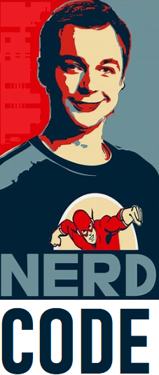

# Projeto Podcast Gerado por I.A.s

 > ℹ️ **NOTE:** 
Este é o repositório desenvolvido durante um curso, com o objetivo de gerar um podcast utilizando ferramentas de IA através de prompts mais trabalhado.
Os prompts foram usados para gerar cada etapa do processo criativo.

## 💻 Tecnologias utilizadas no projeto

- [ChatGPT](https://chat.openai.com/) 
- [ElevenLabs](https://beta.elevenlabs.io/)
- [Capcut](https://www.capcut.com/pt-br/)

## ✨ Como foi feito ?

- Roteiro gerado via chatgpt
- Audio gerado pela elevenLabs
- Capcut para tratar aúdio e adicionar sons de fundo

## 📚 Materiais
- 🤖 1. prompts de roteiro no `chagpt`
- 🤖 2. audio de roteiro gerados pelo chatgpt no  `ElevenLabs`

